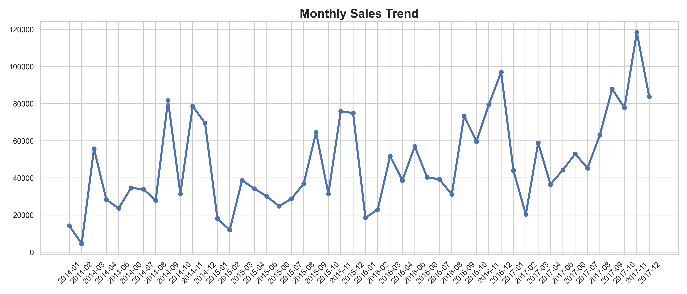
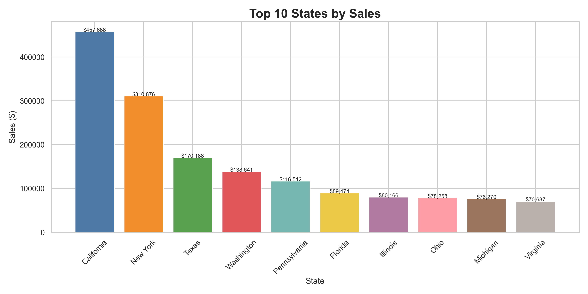
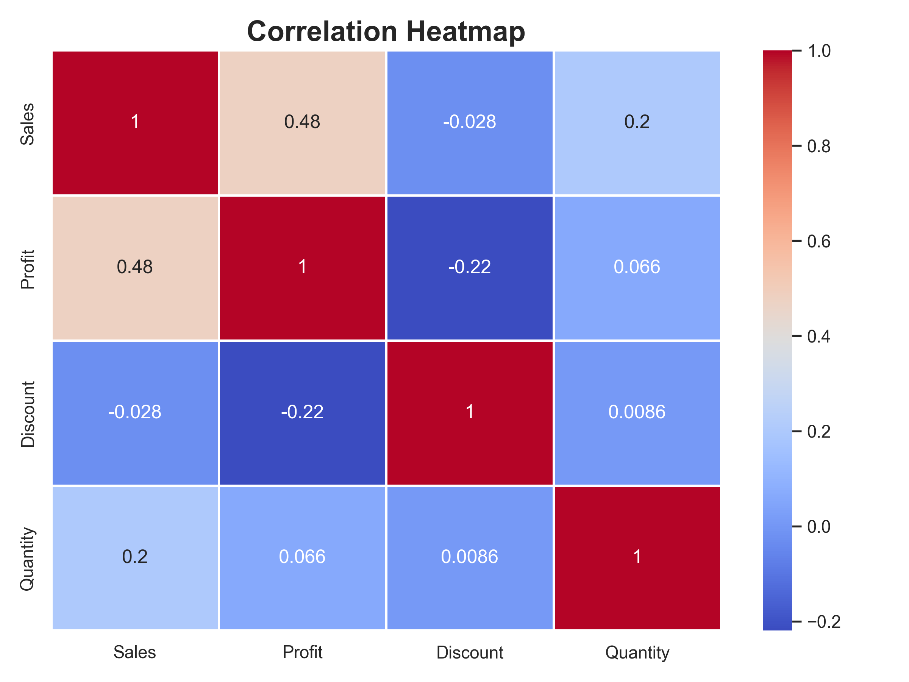
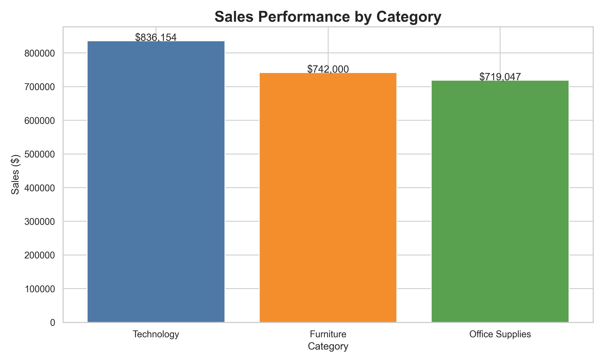
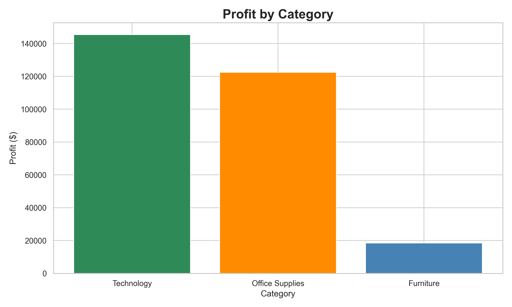
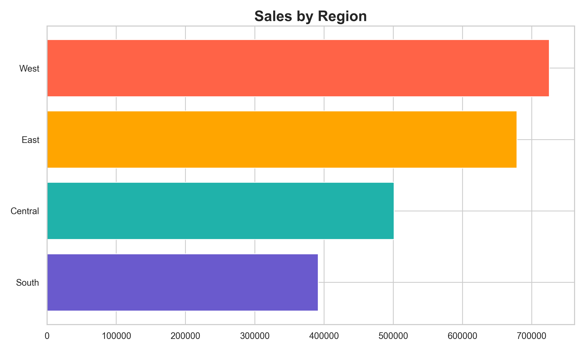

# 🛍️ Retail Sales Analysis & Sales Prediction


## 📌 Project Overview
This project analyzes a real-world retail sales dataset to identify business trends, customer purchasing patterns, regional performance, and profitability insights. The project also includes a Machine Learning model to predict sales using business-related features.

The objective is to demonstrate practical Data Analysis, Data Visualization, and Machine Learning skills using Python.

---
# 🛍️ Retail Sales Analysis & Sales Prediction

## 📌 Project Overview
...

## 📊 Project Highlights

### Monthly Sales Trend


### Top 10 States by Sales


### Correlation Heatmap


## 🎯 Project Objectives

- Perform data cleaning and preprocessing
- Analyze retail sales performance
- Identify top-performing categories and regions
- Visualize business insights using professional charts
- Build a sales prediction model using Machine Learning
- Generate actionable business recommendations

---

## 🛠️ Technologies Used

- Python
- Pandas
- NumPy
- Matplotlib
- Seaborn
- Scikit-learn

---

## 📂 Dataset Information

Dataset: Superstore Sales Dataset

The dataset contains:

- Customer Information
- Product Categories
- Sales Data
- Profit Data
- Regional Information
- Order Details

Total Records: 9,994

---

## 📊 Exploratory Data Analysis

The following analyses were performed:

### 1. Sales by Category
Identifies which product categories generate the highest revenue.

### 2. Profit by Category
Shows profitability across different product categories.

### 3. Monthly Sales Trend
Analyzes sales growth and seasonal trends over time.

### 4. Region-wise Sales Analysis
Compares sales performance across regions.

### 5. Top 10 States by Sales
Highlights the highest revenue-generating states.

### 6. Correlation Heatmap
Shows relationships between Sales, Profit, Quantity, and Discount.

---

## 📈 Visualizations

### Sales by Category


### Profit by Category


### Monthly Sales Trend


### Region-wise Sales


### Top 10 States by Sales


### Correlation Heatmap


---

## 🤖 Machine Learning Model

### Model Used

- Linear Regression

### Features

- Quantity
- Discount
- Profit

### Target Variable

- Sales

### Evaluation Metrics

- R² Score
- Mean Absolute Error (MAE)
- Root Mean Squared Error (RMSE)

---

## 🔍 Key Business Insights

- Technology category generated the highest sales revenue.
- Sales performance varies significantly across states.
- Regional differences impact overall business performance.
- Discounts can negatively affect profitability.
- Sales trends fluctuate across different months.

---

## 📌 Conclusion

This project successfully analyzed a retail sales dataset using Python and Data Science techniques. Data cleaning, exploratory data analysis, and visualization helped uncover important business insights. A Machine Learning model was developed to predict sales performance, demonstrating the complete end-to-end data science workflow.

---

## 🚀 How to Run

### Clone Repository

```bash
git clone <your-repository-url>
```

### Install Dependencies

```bash
pip install -r requirements.txt
```

### Run Project

```bash
python retail_analysis.py
```

---

## 📁 Project Structure

```text
Retail-Sales-Analysis/
│
├── data/
│   └── Superstore.csv
│
├── images/
│   ├── sales_by_category.png
│   ├── profit_by_category.png
│   ├── monthly_sales_trend.png
│   ├── region_sales.png
│   ├── top10_states_sales.png
│   └── correlation_heatmap.png
│
├── retail_analysis.py
├── requirements.txt
├── README.md
└── .gitignore
```

---

## 👨‍💻 Author

**Samruddhi Gawade**

Aspiring Data Analyst & Data Science Enthusiast

- Python
- Data Analysis
- Machine Learning
- Data Visualization


